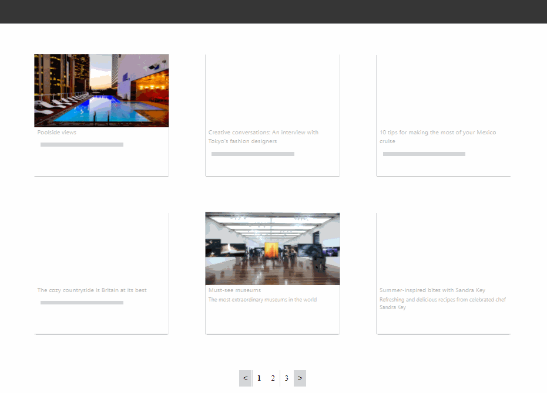

## FullStack Project - Responsive cards

### General info:
##### Built with
- [Angular](https://angular.io/start)
- [Express](https://expressjs.com/)
- [AirTable](https://airtable.com/)
- [tailwindcss](https://tailwindcss.com/)

##### ./api - Node.js serverless function deployed to Vercel.
##### ./server - Express server for local development.
##### ./src - Client side Code in Angular.


### Installation and Setup Instructions:
Clone down this repository. You will need [node](https:https://nodejs.org/en/) and [npm](https:https://nodejs.org/en/) installed globally on your machine. 

#### Run project locally:
To install:
```bash
npm install
```
To start server and client side:
```bash
npm start  
```
To Visit App:
[http://localhost:4200]

#### App hosted on Vercel:
Live Site: [https://tailor-brands-assignment-kohl.vercel.app/]

### Screen Shots:



